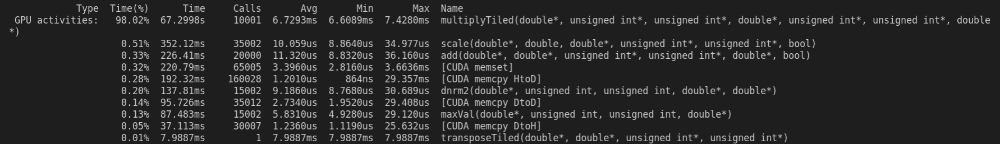

# LSQR-CUDA
## Overview
LSQR-CUDA is written by Lawrence Ayers under the supervision of Stefan Guthe of the [GRIS](https://www.informatik.tu-darmstadt.de/gris/startseite_1/team/index.de.jsp) institute at the Technische Universität Darmstadt. It is a CUDA port of the LSQR algorithm of Chris Paige and Michael Saunders

The goal of this work was to accelerate the computation time of the well-known [LSQR](https://web.stanford.edu/group/SOL/software/lsqr/) algorithm using a CUDA capable GPGPU.

The LSQR algorithm is an iterative method used to find the solution x for either of the following problems:
* Ax=b
* min(||Ax-b||)

where A is a large, often sparse, square or rectangular matrix, and b is a vector of size #A-rows.

LSQR was first authored by Chris Paige and Michael Saunders in their publication [here](https://web.stanford.edu/group/SOL/software/lsqr/lsqr-toms82a.pdf), and has since been widely used for various applications.

## Requirements
LSQR-CUDA has the following requirements:
* *nix system or WSL for windows machines
* CUDA Capable GPGPU
* CUDA (nvcc) v11 or higher 
* g++ v11 or higher
* make

## Execution
To run the software, enter the [source](source/) directory and type the following command into your terminal
```
make run
```
### Inputs
You will then be asked if you would like automatic test inputs generated for you and what sparsity you would like to have Matrix A set to. The range of auto-generated inputs is set in ln 107-109 of [main.cu](source/gpu/main.cu), but can be manually changed if desired. If you have your own inputs available, you will need to save them as files with .mat (dense and sparse matricies) and .vec (vectors) extensions in the [input](source/input/) directory. These must use a white space delimiter: " ", and have a number of values such that Ax=b can be satisfied.

Inputs should have the following notation:
* ```#Arows_#Acols_A_#sparsity.mat```
* ```#Arows_1_b.vec```

As an example, a sparse matrix A with 1500 rows, 2000 columns, and a sparsity of 0.75% would have the following input files:
* ```1500_2000_A_75.mat```
* ```1500_1_b.vec```

### Outputs
The solution, x, will be written to [output](source/output/) in a directory corresponding to the time of execution (Year-Month-DayTHourMinute) in the format:
* ```YYYY-MM-DDTHHMM/#Acols_1_x_implementation.vec```

for the above example, the x output file would look like this:
* ```YYYY-MM-DDTHHMM/2000_1_x_CUDA-SPARSE.vec```

The 5 different implementations created for this work will then run on each set of inputs located in the [input](source/input/) directory, with the runtime of each saved to a csv called ```YYYY-MM-DDTHHMM/YYYY-MM-DDTHHMM_LSQR-CUDA.csv```
___

<details open>
<summary><b>Table of Contents</b></summary>
<!-- MarkdownTOC -->

1.  [Introduction](#Introduction)
1.  [Background](#Background)
1.  [Methods](#Methods)
    1.  [Cpp-DENSE](#Cpp-DENSE)
    1.  [CUDA-DENSE](#CUDA-DENSE)
    1.  [CUDA-SPARSE](#CUDA-SPARSE)
    1.  [CUBLAS-DENSE](#CUBLAS-DENSE)
    1.  [CUSPARSE-SPARSE](#CUSPARSE-SPARSE)
1.  [Results](#Results)
    1.   [Speedup](#Speedup)
    1.   [Accuracy](#Accuracy)
1.  [Conclusion](#Conclusion)
<!-- /MarkdownTOC -->
</details>

___
<a id="Introduction"></a>
## 1. Introduction
The purpose of this work was to implement the LSQR algorithm on a CUDA-capabale GPU to analyze any potential runtime speedups in comparison to a standard, sequential CPU implementation. When run in CUDA, many matrix operations (e.g. multiplication, euclidean norm, addition, subtraction, etc.) can be run in parallel, and can, therefore, decrease computation time.

This work has both sequential and parallel implementations of LSQR that are intended for both sparse and dense inputs. The 5 implementations are listed as follows:

1.  Cpp-DENSE (CPU)
1.  CUDA-DENSE (GPU)
1.  CUDA-SPARSE (GPU)
1.  CUBLAS-DENSE (GPU)
1.  CUSPARSE-SPARSE (GPU)

A sparse sequential algorithmn was not explicitly created for this work, rather, the robust [scipy-lsqr](https://docs.scipy.org/doc/scipy/reference/generated/scipy.sparse.linalg.lsqr.html) algorithm was used instead for verifying results and comparison of runtimes.
___
<a id="Background"></a>
## 2. Background
___
<a id="Methods"></a>
## 3. Methods
The LSQR algorithm in this work is largely based off the scipy-lsqr [source code](https://github.com/scipy/scipy/blob/v1.6.1/scipy/sparse/linalg/isolve/lsqr.py#L96-L568) as well as the C++ port provided by Luis Ibanez. In LSQR-CUDA, this algorithm is located in the lsqr.hpp file, whereby each implemenation is passed as a class type and run 

<a id="Cpp-DENSE"></a>
## CPU Implementations
### [Cpp-DENSE](source/cpu/vectorCPU.hpp)
The Cpp-Dense implementation is written in C++ and runs the sequentially on the CPU. This implementation uses Naive operations for add, subtract, multiply, Dnrm2, etc. It is the slowest of the implementations and used as a baseline to compare to Dense GPU implementations.
Corresponding source files are [vectorCPU.cpp](source/cpu/vectorCPU.cpp) and [vectorCPU.hpp](vectorCPU.hpp)

### [scipy-lsqr](https://github.com/scipy/scipy/blob/v1.6.1/scipy/sparse/linalg/isolve/lsqr.py#L96-L568)
Scipy's lsqr solver runs on either sparse or dense inputs and is used as a baseline to compare to the sparse LSQR-CUDA implementations created here. Related information can be found on scipy's [website](https://docs.scipy.org/doc/scipy/reference/generated/scipy.sparse.linalg.lsqr.html), and its use in this work can be found in [lsqr.py](python/lsqr.py)

<a id="CUDA-DENSE"></a>
## GPU Implementations
All source files pertaining to GPU implementations can be found in in the [gpu](source/gpu/) directory.

For all kernels designed in this work, the blockSize (i.e. the number of threads in a block) is set to a constant value found in [utils.cuh](source/gpu/utils.cu#L3). This means that the The use of cached memory lowers the latency in comparison to global memory in cal,

The kernels used for these implementations is where the majority of development for LSQR-CUDA was spent. 

### [CUDA-DENSE](source/gpu/vectorCUDA.cuh)
The CUDA-DENSE implementation is written with the standard CUDA library, and executes many of its own [kernels](source/gpu/kernels.cuh) for various vector operations. This implementation takes in two dense sources and runs them through lsqr with accelerated multiplication, addition/subtraction, euclidean norm, and transpose operations. 

An output of nvprof for this implementation can be seen here:



#### Multiplication
The most time intensive operation of LSQR is the matrix-vector and vector-vector multiplication operations. Since CUDA-DENSE works only with dense inputs, this operation is treated the same for both matrix-vector and vector-vector multiplication (i.e. neither matrix nor vector are in a compressed format). 

A naive approach to multiplication would be have a singular thread solve for one entry in the solution matrix, i.e. a thread accesses one row of the first input and one column of the second input from global memory to perform the dot product of these two arrays in a loop. Since the latency of global memory accesses can be quite high a cached, "tiled" memory solution was used. Although not used in this work, a functioning [multiplyNaive](source/gpu/kernels.cu#L114) kernel was created for reference.

In the "tiled" approach to matrix multiplication, [multiplyTiled](source/gpu/kernels.cu#L125), inputs are first loaded into GPU-cached (["shared"](https://developer.nvidia.com/blog/using-shared-memory-cuda-cc/)) memory, or "tiles", that iteratively "sweep" across inputs, saving and continuously summing up the result with the running total in each iteration. Each thread works in parallel towards calculating one value in the resultant matrix. An excellent visual representation of this can be found in Penny Xu's work, [Tiled Matrix Multiplication](https://penny-xu.github.io/blog/tiled-matrix-multiplication).

In multiplyTiled, the use of cache memory halves the number of global memory accesses required for each thread in comparison to the naive approach. For a dense input of 2500x2500, this implementation has a speedup of about 1.5x when switching from multiplyNaive to multiplyTiled.

#### Scale
The scale operation utilizes a naive approach. Since 

#### Euclidean Norm
The euclidean norm or Dnrm2 kernel is the second most expensive operation in this implementation, 

#### Transform


#### Addition and Subtraction

<a id="CUDA-SPARSE"></a>
### [Cpp-DENSE](source/cpu/vectorCPU.hpp)

<a id="CUBLAS-DENSE"></a>
### [Cpp-DENSE](source/cpu/vectorCPU.hpp)

<a id="CUSPARSE-SPARSE"></a>
### [Cpp-DENSE](source/cpu/vectorCPU.hpp)


___
<a id="Results"></a>
## 4. Results
___
<a id="Conclusion"></a>
## 5. Conclusion
___

# C++ and CUDA implementations of the lsqr algorithm
The following repository is split into two folders, one for the cpu implementation of lsqr, and one for the gpu implementation of lsqr.
___
# CPU Implementation
___
# GPU Implementation
The Kernels used in this implementation are all 2-Dimensional, and can all handle matricies of large various sizes depending on the capabilities of the GPU.

Here, the speed of both naive and optimizied algorithms are analyzed and compared. 

## Naive kernels


## Optimized kernels

### Transpose
The transpose kernel utilizes coalesced memory access via shared memory (block scope).

### Multiply